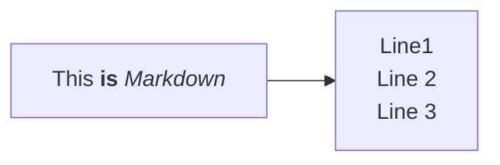
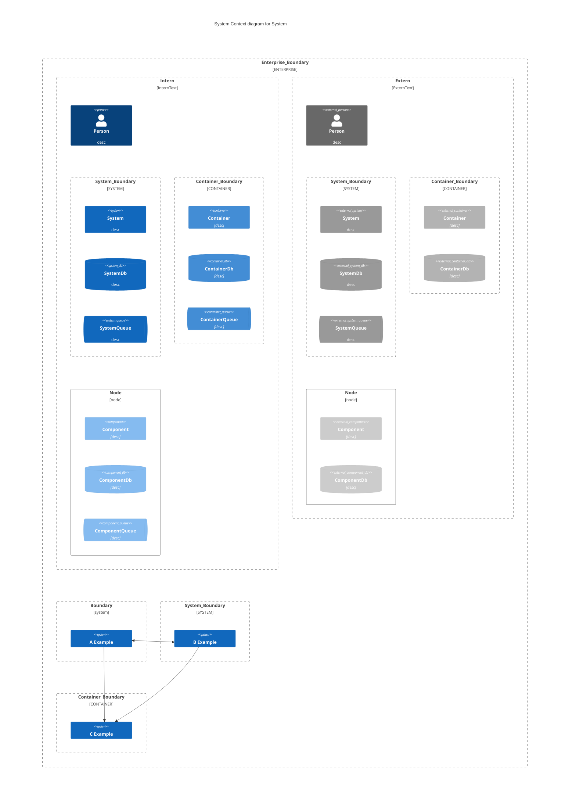

```mermaid
flowchart LR
    markdown["`This **is** _Markdown_`"]
    newLines["`Line1
    Line 2
    Line 3`"]
    markdown --> newLines
```

```mermaid
C4Context
    title System Context diagram for System
    Enterprise_Boundary(enterpriseBoundary0, "Enterprise_Boundary", "NAME") {
        Boundary(intern, "Intern", "InternText") {
            Person(person, "Person", "desc")
            System_Boundary(systemBoundary, "System_Boundary", "NAME") {
                System(system, "System", "desc")
                SystemDb(systemDb, "SystemDb", "desc")
                SystemQueue(systemQueue, "SystemQueue", "desc")
            }
            Container_Boundary(containerBoundary, "Container_Boundary", "NAME") {
                Container(container, "Container", "desc")
                ContainerDb(containerDb, "ContainerDb", "desc")
                ContainerQueue(containerQueue, "ContainerQueue", "desc")
            }
            Node(node, "Node"){
                Component(component, "Component", "desc")
                ComponentDb(componentDb, "ComponentDb", "desc")
                ComponentQueue(componentQueue, "ComponentQueue", "desc")
            }
        }
        Boundary(extern, "Extern", "ExternText") {
            Person_Ext(personExt, "Person", "desc")
            System_Boundary(systemBoundaryExt, "System_Boundary", "NAME") {
                System_Ext(systemExt, "System", "desc")
                SystemDb_Ext(systemDbExt, "SystemDb", "desc")
                SystemQueue_Ext(systemQueueExt, "SystemQueue", "desc")
            }
            Container_Boundary(containerBoundaryExt, "Container_Boundary", "NAME") {
                Container_Ext(containerExt, "Container", "desc")
                ContainerDb_Ext(containerDbExt, "ContainerDb", "desc")
            }
            Node(nodeExt, "Node"){
                Component_Ext(componentExt, "Component", "desc")
                ComponentDb_Ext(componentDbExt, "ComponentDb", "desc")
            }

        }


        Boundary(aBoundary, "Boundary") {
            System(aExample, "A Example")
        }
        
        System_Boundary(bBoundary, "System_Boundary") {
            System(bExample, "B Example")
        }
        Container_Boundary(cBoundary, "Container_Boundary") {
            System(cExample, "C Example")
        }

        BiRel(aExample, bExample, "")
        Rel(bExample, cExample, "")
        Rel_Back(cExample, aExample, "")

        UpdateLayoutConfig($c4ShapeInRow="1", $c4BoundaryInRow="2")
        
      }


```

[//]: # (C4Container)

[//]: # (C4Component)

[//]: # (C4Dynamic)

[//]: # (C4Deployment)

